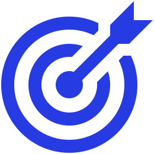

<p align="center">
    
</p>

# YourToDo

[](https://docs.docker.com/)
[](https://www.postgresql.org/)
[](https://flask.palletsprojects.com/en/stable/)
[](https://www.sqlalchemy.org/)
[](https://angular.dev/)


In this repository there is a todo project called YourToDo. With YourToDo you can add, complete and remove your customized tasks.

## 🏃 How to run YourToDo

To run YourToDo you have to have docker compose installed in your computer. If you don't have docker compose, take a look at this [page](https://docs.docker.com/compose/install/). At the root of this project just run this command in a bash:

```bash
docker compose up
```

Done! You can access YourToDo at [http:localhost:4200](http:localhost:4200).

## 🏗️ Project structure

This project is structured in two folders:
- client: This folder contains all the front-end part of the application. Here you gonna find a Angular project.
- server: This folder contains all the back-end part of the application. Here you gonna find a Flask + SQLAlchemy project.